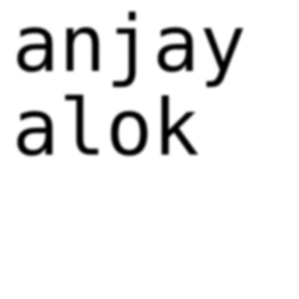

# WhatsApp Brat Sticker Bot

[](LICENSE)

Bot WhatsApp berbasis Node.js untuk membuat stiker teks bergaya brat atau mengubah gambar menjadi stiker. Bot terhubung menggunakan pairing code Baileys dan menyimpan sesi secara lokal.

<p align="center">
  
  <br>
  <em>Pratinjau hasil stiker brat 512 × 512. Ini adalah contoh hasil render, bukan tangkapan layar WhatsApp.</em>
</p>

## Fitur

- Membuat stiker brat dengan perintah `/brat`, `!brat`, atau `.brat`.
- Mengambil teks dari pesan yang dibalas jika perintah brat dikirim tanpa teks.
- Mengubah gambar menjadi stiker dengan caption `.sticker` atau `.stiker`.
- Mengirim stiker sebagai balasan ke pesan sumber.
- Membuat stiker WebP 512 × 512; stiker gambar mempertahankan rasio aspek dan latar transparan.
- Login menggunakan pairing code; sesi disimpan di `session/`.
- Menggunakan font Arial Narrow yang disertakan dalam paket `brat-canvas`.

## Persyaratan

- Node.js **20.9 atau lebih baru**
- npm
- Akun WhatsApp dan ponsel untuk menautkan perangkat

## Instalasi

Clone repository, lalu masuk ke direktori proyek:

```bash
git clone https://github.com/arissrynaa/wa-brat-sticker-bot.git
cd wa-brat-sticker-bot
npm ci
```

Jika belum ada `package-lock.json`, gunakan `npm install`.

## Konfigurasi

Salin file contoh environment:

```bash
cp .env.example .env
```

Edit `.env` dan isi nomor WhatsApp dengan kode negara, **angka saja** tanpa `+`, spasi, atau tanda baca:

```dotenv
PAIRING_NUMBER=628123456789
```

Jangan unggah `.env` atau folder `session/` ke repository. Keduanya sudah dikecualikan oleh `.gitignore`; file sesi berisi kredensial autentikasi akun.

## Menjalankan dan pairing

Jalankan bot:

```bash
npm start
```

Pada koneksi pertama, pairing code akan muncul di terminal. Di WhatsApp ponsel:

1. Buka **Setelan/Pengaturan → Perangkat tertaut**.
2. Pilih **Tautkan perangkat**.
3. Pilih opsi **Tautkan dengan nomor telepon**.
4. Masukkan pairing code yang ditampilkan di terminal.

Setelah berhasil, sesi tersimpan di `session/`. Pada penggunaan berikutnya, jalankan `npm start` kembali; pairing ulang tidak diperlukan kecuali sesi logout atau dihapus.

## Perintah

### Stiker teks brat

Semua prefix berikut didukung:

```text
/brat anjay alok
!brat anjay alok
.brat anjay alok
```

Untuk menggunakan teks dari pesan yang dibalas, reply pesan itu lalu kirim perintah tanpa teks:

```text
/brat
```

Teks dibatasi maksimal 500 karakter. Perintah kosong tanpa pesan yang dibalas akan membalas dengan contoh penggunaan.

### Stiker dari gambar

Kirim gambar dengan caption:

```text
.sticker
```

Alias `.stiker` juga didukung. Prefix `/` dan `!` juga dapat digunakan, misalnya `/sticker`. Bot akan membalas gambar tersebut dengan stiker.

## Bantuan dan troubleshooting

- **Nomor tidak valid atau pairing code tidak muncul:** pastikan `.env` ada di direktori proyek dan `PAIRING_NUMBER` berisi nomor lengkap dengan kode negara, angka saja.
- **Logout atau autentikasi sesi bermasalah:** hentikan bot, hapus folder `session/`, lalu jalankan `npm start` dan pairing kembali.
- **Pesan di chat dengan diri sendiri menampilkan “Waiting for message”:** ini dapat terjadi karena sinkronisasi/dekripsi pesan pada perangkat tertaut. Coba pairing ulang dengan menghapus `session/`. Jika masih terjadi, gunakan chat dengan akun lain; pengiriman ke chat diri sendiri tidak selalu didukung dengan andal.
- **Koneksi WhatsApp belum tersedia:** bot akan mencoba menyambung kembali secara otomatis. Pastikan koneksi internet tersedia dan perhatikan kode error di terminal.

## Struktur proyek

```text
.
├── bot.js
├── package.json
├── package-lock.json
├── .env.example
├── .gitignore
├── fonts/
└── docs/
    └── images/
        └── brat-sticker-demo.webp
```

Font Arial Narrow diambil dari paket `brat-canvas` yang terpasang di `node_modules`; tidak perlu mengunduh atau menambahkan file font secara manual.

## Teknologi

- [Baileys](https://github.com/WhiskeySockets/Baileys) — koneksi WhatsApp Web
- [brat-canvas](https://github.com/MichelleBot/brat-canvas) — render gambar brat
- [Sharp](https://sharp.pixelplumbing.com/) — konversi dan resize gambar ke WebP
- dotenv dan pino — konfigurasi environment dan logger

## Lisensi

Didistribusikan di bawah [MIT License](LICENSE).
